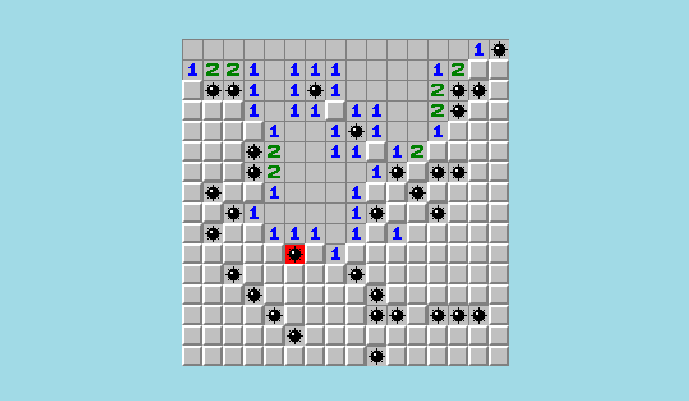

# Minesweeper

Minesweeper is a classic puzzle game that challenges players to uncover a grid of hidden squares while avoiding mines. The grid consists of rows and columns, and beneath some of these squares are dangerous mines. The objective is to reveal all the squares that do not contain mines, using numerical clues provided by the game. Each number displayed on a revealed square indicates how many mines are adjacent to it, allowing players to make strategic decisions about where to click next.

You can play from [HERE](https://noir-games.itch.io/minesweeper)
